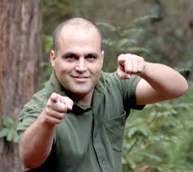
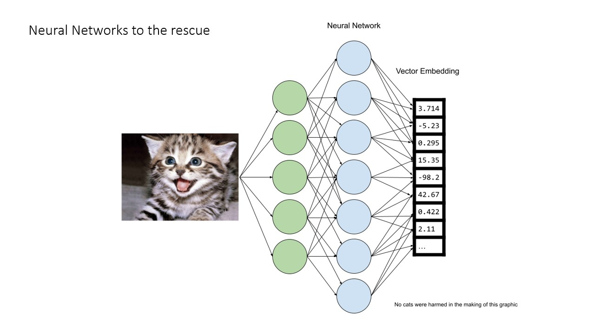
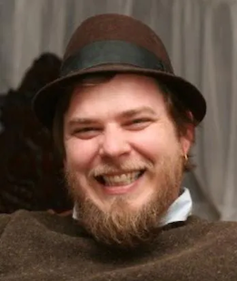
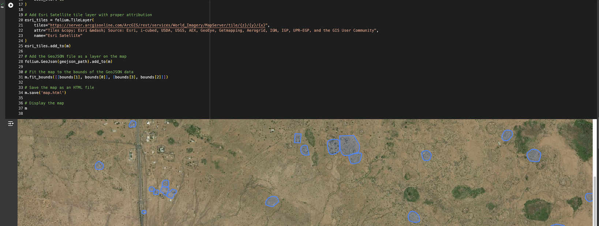
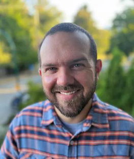
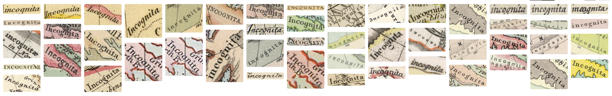

# GISDay@Stanford 2024
## (Tentative) Agenda & Schedule

### **1:30 PM – 1:35 PM**  
**Opening Remarks**  
- Welcome and introduction to the event.

---

### **1:35 PM – 2:30 PM**  
**Learning Keynote: Steve Citron-Pousty - Founder, [Tech Raven Consulting](https://www.techravenconsulting.com/)**  
***"Quick Intro to AI/ML Vector Data for Geospatial Folks"***  

In the last two years, AI machine learning has exploded in prominence. One of the key concepts used in the modeling and storage of AI is vectors. There is no doubt vector data management will be a key concern of most people concerned with the lifecycle of data management. Feeling like you should learn more and how you would use them in your data work? Then have I got a talk for you!  

We will start by explaining the concept of (embedding) vectors and how they are used in the AI life cycle. From there we will go into putting them into a database.  

Now that those vectors are in a database we can talk about the use cases where the technology makes sense. As opposed to an RDBMS, vector databases are more tightly focused and optimized for particular use cases.  

To ground this discussion in something more concrete, we will show live demos of the technology throughout the talks. By the time you leave you will have a strong base to go home and explore more (and impress friends at dinner parties).  

---

### **2:30 PM – 2:50 PM**  
**Stace Maples, Head of The Stanford Geospatial Center**  
***"Food for Thought: Stanford Geospatial Center resources for your ML/AI research and projects"***  

- Updates on support and services provided by the Stanford Geospatial Center.  
 - Planet.com Planetscope & SkySat access. 
 - AIS Data access from SPIRE - Global Shipping Trajectories and Metadata
 - Using Google Earth Engine with your own Google Cloud Project for access to the Earth Engine Python API and more
 - High throughput Geocoding Services with [locator.stanford.edu](https://locator.stanford.edu/)

---

### **2:50 PM – 3:00 PM**  
**Break**  
- 10-minute restroom break and networking opportunity.

---

### **3:00 PM – 3:30 PM**  
**Lightning Talks (5-minutes each)**  
- **TBA Lightning Talk 1**  
- **TBA Lightning Talk 2**  
- **TBA Lightning Talk 3**  
- **TBA Lightning Talk 4**  
- **TBA Lightning Talk 5**

---

### **3:30 PM – 3:50 PM**  
**Evan Thornberry, Head & Curator of the David Rumsey Map Center**    
***"Looking ahead with legacy collections: How computer vision and AI are helping unlock the hidden knowledge within Stanford’s map collections."***  

- An overview of two AI projects: [Machines Reading Maps](https://machines-reading-maps.github.io/) & [Map Reader](https://github.com/maps-as-data/MapReader)  
- A description of the current state of using them on [davidrumsey.com](https://davidrumsey.com),  
- How to stay in the loop and involved.

---

### **3:50 PM – 4:30 PM**  
**Applied Keynote: Cameron Kruse, Creative Technologist, [Earth Genome](https://www.earthgenome.org/)**  
***"Harnessing the power of geospatial foundation models to empower end users"***  

  

Cameron is a Creative Technologist with Earth Genome and a National Geographic Explorer. At Earth Genome Cameron leads the Plotline, an initiative exploring the intersection of food systems and climate change, and supports product and development of Earth Index. In his work with National Geographic, Cameron has led several expeditions where he has produced films, photo essays, and interactive map based stories focused on rural communities and climate change. In his free time, you may find him trail running or struggling to climb large rocks in Yosemite. Learn more about Cameron’s work at cameronwkruse.com or reach out on social media @camkruse. 

---

### **4:30 PM – 4:45 PM**  
**Closing Remarks**  
- Wrap-up, final thoughts and grab some swag.

### **4:455 PM – ??? PM**  
**Join us at The Treehouse at Tressider for Mappy Hour!!**  

