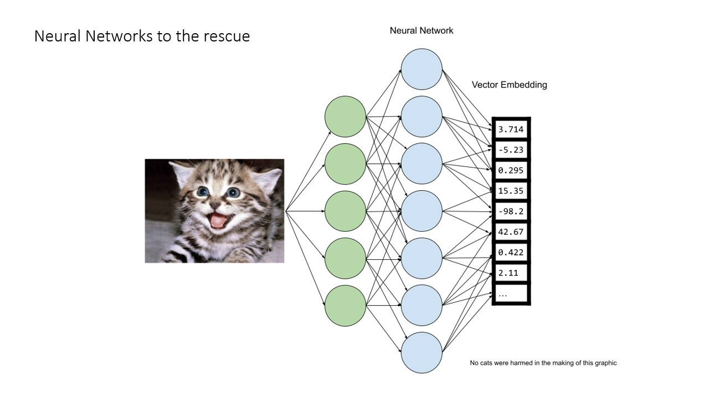
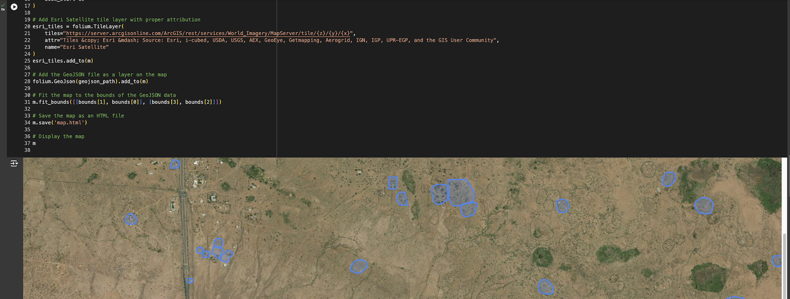

Here’s the agenda with consistent formatting for titles, speaker details, and section headers:

---

# GISDay@Stanford 2024
## (Tentative) Agenda & Schedule

### **1:30 PM – 1:35 PM**  
**Opening Remarks**  
- Welcome and introduction to the event.

---

### **1:35 PM – 2:30 PM**  
### Quick Intro to AI/ML Vector Data for Geospatial Folks  
**Speaker:** Steve Citron-Pousty, Founder, [Tech Raven Consulting](https://www.techravenconsulting.com/)

In the last two years, AI machine learning has exploded in prominence. One of the key concepts used in the modeling and storage of AI is vectors. We’ll discuss the use of vectors in the AI lifecycle, the basics of vector databases, and dive into real-world demos. By the end, you’ll be equipped to explore vector data management further in your own work.

---

### **2:30 PM – 2:50 PM**  
### Food for Thought: Stanford Geospatial Center Resources for Your ML/AI Research and Projects  
**Speaker:** Stace Maples, Head of The Stanford Geospatial Center

- Updates on support and services from the Stanford Geospatial Center  
  - Access to Planet.com Planetscope & SkySat imagery  
  - AIS Data access from SPIRE – Global Shipping Trajectories  
  - Google Earth Engine integration with your Google Cloud Project  
  - High-throughput Geocoding Services via [locator.stanford.edu](https://locator.stanford.edu/)

---

### **2:50 PM – 3:00 PM**  
**Break**  
- 10-minute restroom break and networking opportunity.

---

### **3:00 PM – 3:30 PM**  
### Lightning Talks (5 minutes each)  

#### A High-Resolution Look at Long-Run Development: Evidence from 1.3 Million Historical Photographs  
**Speaker:** Joel Ferguson (he/him), Doerr School of Sustainability / Environmental Social Sciences / Global Policy Lab  
- **Abstract:** Utilizing a newly-digitized archive of 1.3 million historical aerial photographs, we predict population and wealth at a 1km resolution. This analysis explores spatial concentration of wealth and its evolution over time.

---

#### Highway Paving Dramatically Increased Dengue Transmission in the Amazon  
**Speaker:** Alyson Singleton (she/her/hers), Emmett Interdisciplinary Program in Environment and Resources, SDSS  
- **Abstract:** By examining the impact of highway paving on dengue transmission in the Amazon, we highlight infrastructure's effects on public health, showing the correlation between highway development and increased dengue cases.

---

#### Jiangzhai: Geospatial Analysis of Neolithic Village Settlement & Cemetery  
**Speaker:** Crystal Yu (she/her), Stanford Archaeology Center, Department of East Asian Languages and Cultures  
- **Abstract:** This study uses ArcGIS to explore the spatial relationship between household and burial remains at the Early Yangshao period village of Jiangzhai, contributing to understanding social status in early agricultural societies.

---

#### 3D Digital Twins of Environments: The Big and Small  
**Speaker:** Daniel Neamati (he/him), Aeronautics and Astronautics  
- **Abstract:** Learn how the NAV Lab creates models of large and small environments, using Neural Radiance Fields and 3D Gaussian Splatting to produce cutting-edge 3D models essential for environmental and urban applications.

---

### **3:30 PM – 3:50 PM**  
### Looking Ahead with Legacy Collections: How Computer Vision and AI Are Helping Unlock the Hidden Knowledge within Stanford’s Map Collections  
**Speaker:** Evan Thornberry, Head & Curator of the David Rumsey Map Center

- Overview of AI projects [Machines Reading Maps](https://machines-reading-maps.github.io/) and [Map Reader](https://github.com/maps-as-data/MapReader)  
- Current use on [davidrumsey.com](https://davidrumsey.com)  
- How to stay engaged with these projects.

---

### **3:50 PM – 4:30 PM**  
### Harnessing the Power of Geospatial Foundation Models to Empower End Users  
**Speaker:** Cameron Kruse, Creative Technologist, [Earth Genome](https://www.earthgenome.org/)

Cameron, a Creative Technologist with Earth Genome and a National Geographic Explorer, leads Earth Genome’s Plotline initiative and supports Earth Index development. His work explores climate change impacts on food systems. You can learn more at cameronwkruse.com or on social media @camkruse.

---

### **4:30 PM – 4:45 PM**  
**Closing Remarks**  
- Wrap-up, final thoughts, and grab some swag.

---

### **4:45 PM – ??? PM**  
**Join us at The Treehouse at Tressider for Mappy Hour!!**  

--- 

This agenda maintains consistency in titles, speaker information, and media links. Let me know if there are any further changes needed!